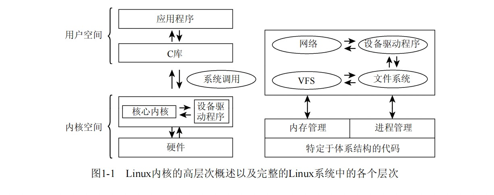

# 深入Linux内核

## Chapter1 简介和概述
### 1. 内核的任务
- 技术层面：是硬件和软件之间的一个中间层。作用是应用程序的请求传递给硬件，并充当底层驱动程序，对系统中的各种设备和组件进行寻址。
- 应用程序视角：内核是一台增强的计算机，应用程序只与内核打交道。
- 多程序并发运行时，可以将内核视为资源管理程序，负责共享资源（cpu、内存、网络、磁盘等）的分配
- 将内核视为库，提供一组面向系统的命令。系统调用用于向计算机发送请求。

### 2. 实现策略
1. 微内核：Micro Kernel。内核只实现最基本的功能，其他功能委托给独立的进程（服务进程，与用户进程同级）。
   - 好处：耦合度降低，伸缩性、扩展性增强
   - 坏处：性能差
2. 宏内核：Monolithic kernel，也叫单内核。内核实现所有功能，所有功能模块链接在一起，可以直接通过方法调用进行交互。
   - 好处：性能极高
   - 坏处：耦合度高

### 3. 内核的组成部分
- 
- 进程：系统运行的每个程序都称为进程。每个进程在CPU的虚拟内存中分配地址空间。每个进程的地址空间是独立的。linux是多任务系统，系统中同时运行的进程数最多不超过Cpu数目。内核会按照短时间间隔在不同进程之间进行切换。
- 进程切换：进程之间的切换。内核借助Cpu的帮助，负责进程切换的技术细节。
- 进程调度：内核需要确定如何在现存进程之间共享Cpu时间。重要的进程获得的时间多一点，次要的进程获得的时间少一点。确定哪个进程运行多长时间称为<b><i>进程调度</b></i>。

3.1 Unix进程
- 重量级进程。Linux系统进程层次结构：进程树，init是进程树的根。查看命令：pstree
- 两种创建进程的方式：fork和exec。
- fork: 
  - 创建当前进程的副本，父进程和子进程只有PID不同。
  - Linux优化：写时复制（copy on write），主要原理是将内存复制延迟到父进程或子进程向某内存页写入数据之前，在只读访问的情况下父进程和子进程可以共用同一内存页。
  - 示例：新建浏览器窗口。
- exec:
  - 将一个新程序加载到当前进程的内存中执行。旧程序的内存页将被刷出，其内容将替换为新的数据。
- 线程：轻量级进程。Linux采用clone方式创建线程。

## Chapter2