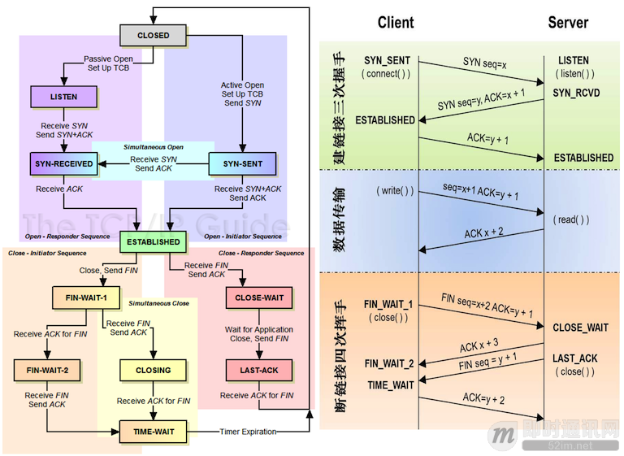

# TCP概述

## 概述
1. 传输控制协议（英语：Transmission Control Protocol，缩写：TCP）是一种面向连接的、可靠的、基于字节流的传输层通信协议，由IETF的RFC 793定义。
   * 面向连接：传输之前需要先建立连接。类似打电话。
   * 可靠的：不是不会丢，但有机制保证。
   * 基于字节流：传输的都是二进制。
2. TCP只负责对数据进行传输，不对数据进行解释。
   * TCP不知道传输的字节流是二进制、ASCII字符还是其他类型数据
   * 对字节流的解释由TCP连接的双方应用层进行解释

## 可靠性保证
1. 应用数据被分割成TCP认为最适合发送的数据块。
   * TCP传递给IP的信息单位称为报文段或段（segament）
2. 当TCP发出一个段后，它启动一个定时器，等待目的端确认收到这个报文段。如果不能及时收到一个确认，将重发这个报文段。
3. 当TCP收到发自TCP连接另一端的数据，它将发送一个确认。这个确认不是立即发送，通常将推迟几分之一秒。
4. TCP将保持它首部和数据的检验和。这是一个端到端的检验和，目的是检测数据在传输过程中的任何变化。如果收到段的检验和有差错，TCP将丢弃这个报文段和不确认收到此报文段（希望发端超时并重发）。
5. 既然TCP报文段作为IP数据报来传输，而IP数据报的到达可能会失序，因此TCP报文段的到达也可能会失序。如果必要，TCP将对收到的数据进行重新排序，将收到的数据以正确的顺序交给应用层。
6. 既然IP数据报会发生重复，TCP的接收端必须丢弃重复的数据。
7. TCP还能提供流量控制。
   * TCP连接的每一方都有固定大小的缓冲空间。TCP的接收端只允许另一端发送接收端缓冲区所能接纳的数据。这将防止较快主机致使较慢主机的缓冲区溢出。

## TCP首部
1. 封装在IP数据包中
   
2. TCP包首部格式
   

## TCP连接的建立与终止

### 建立
> 建立连接需要三次握手
1. 三次握手
2. 连接超时

### 终止
> 断开连接需要四次挥手
1. 四次挥手  
2. 2MSL等待状态
   * TIME_WAIT状态也称为2MSL等待状态。

### 状态转化

### 最大报文长度
* 最大报文段长度（MSS）表示TCP传往另一端的最大块数据的长度。
* 当一个连接建立时，连接的双方都要通告各自的MSS。
* 如果目的IP地址为“非本地的(nonlocal)”，MSS通常的默认值为536字节。
* 加上20字节的IP首部和20字节的TCP首部，可支持576字节IP数据报。

## TCP数据流
1. TCP交互式数据流（10%）
   * Rlogin
   * 交互数据总是以小于最大报文段长度的分组发送。
     * 在Rlogin中通常只有一个字节从客户发送到服务器。
     * Telnet允许一次发送一行输入数据，但是目前大多数实现仍然发送一个字节。
   * 对于这些小的报文段，接收方使用经受时延的确认方法来判断确认是否可被推迟发送，以便与回送数据一起发送。
     * 这样通常会减少报文段的数目，尤其是对于需要回显用户输入字符的Rlogin会话。
   * 在较慢的广域网环境中，通常使用Nagle算法来减少这些小报文段的数目。
     * 这个算法限制发送者任何时候只能有一个发送的小报文段未被确认。
2. TCP成块数据流（90%）
   * FTP
   * 数据发送方在发送下一个数据块之前需要等待接收对已发送数据的确认。

## TCP流量控制
1. 滑动窗口

## TCP超时和重传
1. 超时判断
2. 拥塞判断
3. 慢启动、拥塞避免、快速重传和快速恢复

## TCP定时器
1. 坚持定时器
   * 窗口探查和坚持定时器
2. 保活定时器
   * 可以连接一直存在，但无数据交互。
   * 保活并不是TCP规范中的一部分。
     * 可能出错，误报。
     * 耗费不要的带宽。
     * 分组计费的话，多花钱。
   * 保活定时器是一个有争论的功能。
   * 问题：
     * 断网，TCP连接会断吗？

## TCP的未来和性能
* 路径MTU发现、窗口扩大选项、时间戳选项和T/TCP

## 注意点
1. ACK的传输并不可靠，也就是说，TCP不对ACK报文段进行确认，TCP只确认那些包含有数据的ACK报文段。

## 问题：
1. Q:为何建立连接需要3次握手，断开连接却需要4次挥手？
   A: 这由TCP的半关闭（halfclose）造成的。
      - TCP连接是全双工（即数据在两个方向上能同时传递），每个方向必须单独地进行关闭。
      - 首先进行关闭的一方（即发送第一个FIN）将执行主动关闭，而另一方（收到这个FIN）执行被动关闭。
      - 主动关闭的一方，不能再发送数据，但是仍可以接受数据。被动关闭的一方，不再接受数据，但是仍可以发送数据。
2. Q：网络中标准的端口号范围是多少？
   A：0~65535
3. Q：只可以支持65535个连接吗？
   A：不是。   
4. 断网会断开TCP连接吗？

## 疑问
1. 如何路由寻址。
2. 怎么确定最优的MTU、MSS

## 链接
[[通俗易懂]深入理解TCP协议（上）：理论基础](http://www.52im.net/thread-513-1-1.html)
[[通俗易懂]深入理解TCP协议（下）：RTT、滑动窗口、拥塞处理](http://www.52im.net/thread-515-1-1.html)

